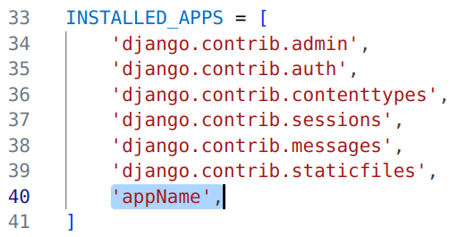
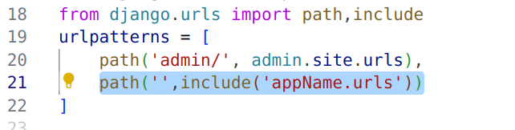
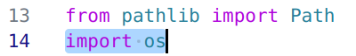
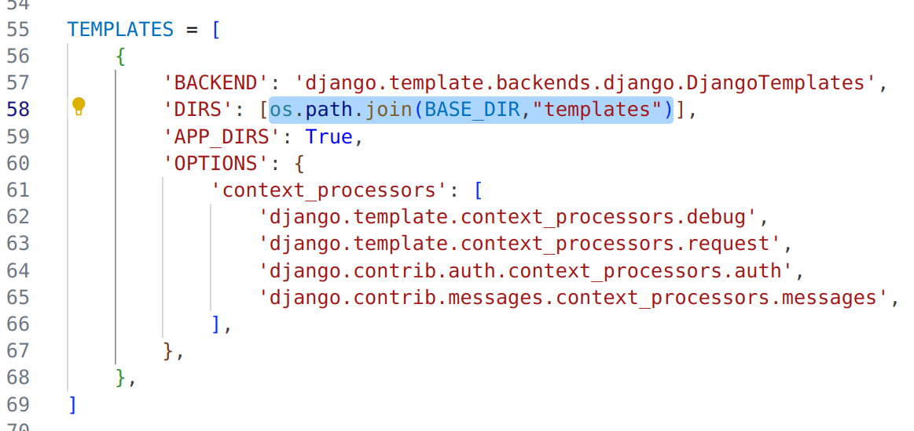
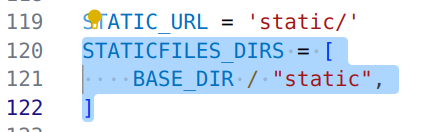

# Django
## Installation (Ubuntu )
```bash 
sudo apt install python3-pip
``` 
```bash
sudo apt install python3-django
```
\
[*Commands below work on any Operating System*]
## Starting a project 
```bash 
django-admin startproject projectName
```
## Starting an app
###### Run the following command when you (terminal) are at the directory same as your manage.py file. 
```bash 
django-admin startapp appName
```
#### After Starting an App remember to :

 ###### &nbsp;&nbsp; 1. Enter the app name to INSTALLED_APPS list
 
###### &nbsp;&nbsp; 2. Include your new app's urls in the main urls.py:

[Note: *You need create a urls.py file under new app and import the include method like shown in screenshot*]
## Rendering HTML templates
To connect a directory (folder) named *templates*, which will contail all of your HTML templates, you need to connect it with your project. Once you connect it by writing some codes in your settings.py file, you are ready to render any amount of HTML templates in your project.
###### &nbsp;&nbsp; 1. Import os :

###### &nbsp;&nbsp; 2. After importing os, add the highlighted course :

## Connecting CSS 
Once you follow this step you can connect as many static files as you want in your project without having to make any change in your settings.py 
###### &nbsp;&nbsp;Add the following lines of code in settings.py:
```
STATICFILES_DIRS = [
    BASE_DIR / "static",
]
```
*It should look like the screenshot below:*


## Connecting mysql
```bash
sudo apt-get install python3-dev default-libmysqlclient-dev build-essential pkg-config
```
```bash
pip install mysqlclient
```
<pre>DATABASES = {
    'default': {
        'ENGINE': 'django.db.backends.mysql',
        'NAME': 'MedicalService',
        'HOST': '127.0.0.1',
        'PORT': '3306',
        'USER': 'root',
        'PASSWORD': ''
    }
}</pre>
