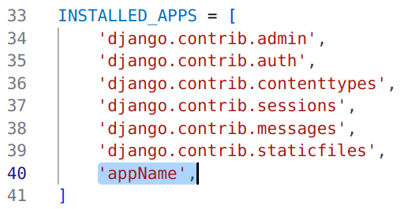
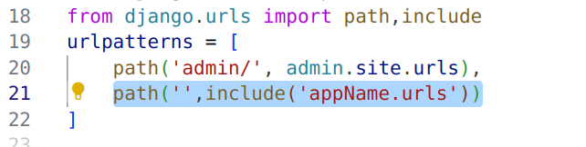
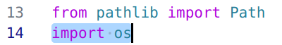
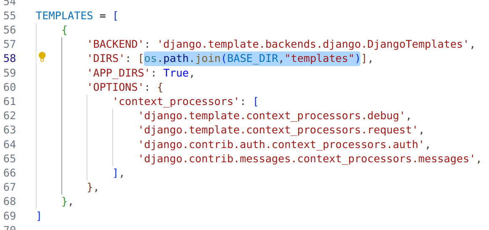
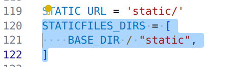

# Django
## Installation (Ubuntu )
```bash 
sudo apt install python3-pip
``` 
```bash
sudo apt install python3-django
```
\
[*Commands below work on any Operating System*]
## Setting up a project 
### Start (create) a project 
```bash 
django-admin startproject projectName
```
### Start (create) an app  
###### Run the following command when you (terminal) are at the directory same as your **manage.py** file. 
```bash 
django-admin startapp appName
```
#### After Starting an App always remember to :

 ###### &nbsp;&nbsp; 1. Enter the app name to INSTALLED_APPS list
 
###### &nbsp;&nbsp; 2. Include your new app's urls in the main urls.py:


[Note: *You need create a urls.py file under new app and import the include method like shown in screenshot*]
### Rendering HTML templates
To connect a directory (folder) named **templates**, which will contain all of your HTML templates, you need to connect it with your project. Once you connect it by writing some codes in your settings.py file, you are ready to render any amount of HTML templates in your project.
###### &nbsp;&nbsp; 1. Import os :

###### &nbsp;&nbsp; 2. After importing os, add the highlighted line of code :

\
[Note: *Your .html files (like homepage.html) should be under a folder named **templates**, which should be in the same directory as your **manage.py** file*]
### Using CSS 
Once you follow this step you can connect as many static files as you want in your project without having to make any change in your settings.py 
###### &nbsp;&nbsp;Add the following lines of code in settings.py:
```
STATICFILES_DIRS = [
    BASE_DIR / "static",
]
```
\
*It should look like the screenshot below:* 
\

\
Connect your static css file in the HTML template like below:
```
<link rel="stylesheet" href="">
```
[Note: *Your .css files (like styles.css) should be under a folder named **static**, which should be in the same directory as your **manage.py** file and **templates** directory*]

## Connecting Database (MySQL)
Even though Django provides SQLite out of the box and you don't have to integrate any other database unless you are planning to deploy it on a host like "Vercel" or you are building a large scale project. Here is the configuration and installation process of MySQL database.  
### Installation on Ubuntu 
```bash
sudo apt-get install python3-dev default-libmysqlclient-dev build-essential pkg-config
```
```bash
pip install mysqlclient
```
### Configuration in setting.py in the django project (don't worry about the OS)
```bash
DATABASES = {
    'default': {
        'ENGINE': 'django.db.backends.mysql',
        'NAME': 'NameOfYourDatabase',
        'HOST': '127.0.0.1',
        'PORT': '3306',
        'USER': 'root',
        'PASSWORD': ''
    }
}
```
## Authentication
You will need to create an app to handle authentications. I will walk you through 5 ways how you can manage the authentications of users in Django
### Common in all the methods:
#### Including authentication URLs
In the app for handling user accounts, you need to include built-in authentication urls. Go to *urls.py* file and add the following lies of code:
```py
from django.urls import path, include
from . import views

urlpatterns = [
    path("/",include("django.contrib.auth.urls")),
    path("signup",views.signup,name="signup")
]
```
This will include the following url patterns for you:
```py
login/ [name='login']
users/ logout/ [name='logout']
users/ password_change/ [name='password_change']
users/ password_change/done/ [name='password_change_done']
users/ password_reset/ [name='password_reset']
users/ password_reset/done/ [name='password_reset_done']
users/ reset/<uidb64>/<token>/ [name='password_reset_confirm']
users/ reset/done/ [name='password_reset_complete']
users/ signup [name='signup']
```
#### Log In
Now to render the templates, you need to create directory (folder) named *registration* under your usual *templates* directory (folder). Create the html files in "templates/registration" directory (folder). For examples: "templates/registration/login.html".<br>
Following is enough for creating the login.html file:
```py
<form method="post">
    
    {{form}}
    <button type="submit">Log In</button>
</form>
```
#### Log Out and Homepage 
We will create a basic "home.html" file and add the view function in the main app (that has the project name). There is no *views.py* given. So, we will create one and add the following lines:
```py
from django.shortcuts import render

def home(request):
    return render(request,"home.html")
```
Our *home.html* looks like this:
```py

Welcome, {{user.username}}! <br>
<a href="">Log Out</a>

<a href="">Log In</a> or <a href="">Sign Up</a>

```
Here, we are checking if the user is authenticated (logged in) or not and showing relevent links accordingly. Notice that we used the logout url here. This is how you implemented the logout as well. <br>
Now, we need to add the path to our homepage in *urls.py* :
```py
from django.contrib import admin
from django.urls import path,include 
from . import views 

urlpatterns = [
    path('admin/', admin.site.urls),
    path("",views.home,name="home"),
    path("users/",include("authen.urls")),
]
```
Now, as we have a homepage, we can check if we correctly loggin in and logging out. This is important to add these two lines in your *settings.py* file:
```py
LOGIN_REDIRECT_URL = "/"
LOGOUT_REDIRECT_URL = "/"
```
These will redirect the users to our homepage instead of Django's default route. 

### Method 1: Built-in (Very Basic)
In this method we will create the most basic authentication only with username and passwords. As we dont have the email of the user we can't implement advanced features like resetting password. 

#### Sign Up
To register (sign up) a user, we will use the built-in *UserCreationForm* provided by Django. As you can see we already added the routing for signup in our *urls.py* file. 
Now add the following lines in your *views.py* file:
```py
from django.shortcuts import render,redirect
from django.contrib.auth.forms import UserCreationForm

def signup(request):
    if request.method=="POST":
        form = UserCreationForm(request.POST)
        if form.is_valid():
            form.save()
            return redirect("login")
    form = UserCreationForm()
    return render(request,"signup.html",{"form":form})
```
We will have to create the *signup.html* file under templates directory. (*templates/signup.html* )
```py
<form method="post">
    
    {{form}}
    <button type="submit">Submit</button>
</form>
<a href="">Already have an account?</a>
```
#### Changing Password (Optional)
To change password we can create a "password_reset_form.html" file and place it under "templates/registration" directory (folder). 
```py
<form method="post">
    
    {{form}}
    <button type="submit">Submit</button>
</form>
```
And create a "password_reset_done.html" to confirm the password change.
```py
<h3>Your password is changed!</h3>
<a href="/">Home</a>
```
### Method 2: Built-in (Basic)
We will receive more informations of the users and add some more functionality in this method. 
#### Sign Up
To register (sign up) a user, we will use the built-in *UserCreationForm* provided by Django. As you can see we already added the routing for signup in our *urls.py* file. 
Now create a *forms.py* file and add the following lines in your *forms.py* :
```py
from django.contrib.auth.forms import UserCreationForm
from django.contrib.auth.models import User

class SignUpForm(UserCreationForm):
    class Meta:
        model = User
        fields = ["first_name", "last_name", "username", "email", "password1", "password2"]
```
Now let's render this form in our *views.py* file:
```py
from django.shortcuts import render,redirect
from .forms import SignUpForm

def signup(request):
    if request.method=="POST":
        form = SignUpForm(request.POST)
        if form.is_valid():
            form.save()
            return redirect("login")
    form = SignUpForm()
    return render(request,"signup.html",{"form":form})
```
We will have to create the *signup.html* file under templates directory.("templates/signup.html")
```py
<form method="post">
    
    {{form}}
    <button type="submit">Submit</button>
</form>
<a href="">Already have an account?</a>
```
#### Reset Password (Optional)
If the email backend is configured correctly, user can reset the password. Create a 'password_reset_form.html' file in "templates/registration" directory (folder):
```py
<form method="post">
    
    {{form}}
    <button type="submit">Submit</button>
</form>
```
Create a "password_reset_done.html" file in the same directory confirming the mail is sent!
```py
<h4> Sent an email. Follow the instructions to reset password. </h4>
```
Create a "password_reset_confirm.html" file in the same directory (folder):
```py
<form method="post">
    
    {{form}}
    <button type="submit">Submit</button>
</form>
```
Lastly, create a "password_reset_complete.html" file:
```py
<h2>Your password is reset!</h2>
```
Let's update our "home.html" file to add the password reset link:
```py

Welcome, {{user.username}}! <br>
<a href="">Change Password</a><br>
<a href="">Reset Password</a><br>
<a href="">Log Out</a>

<a href="">Log In</a> or <a href="">Sign Up</a>

```


## Email Configuration
```py
EFAULT_AUTO_FIELD = 'django.db.models.BigAutoField'
EMAIL_BACKEND = 'django.core.mail.backends.smtp.EmailBackend'
EMAIL_HOST = 'smtp.gmail.com'
EMAIL_PORT = 587
EMAIL_USE_TLS = True
EMAIL_HOST_USER = 'confidential' 
EMAIL_HOST_PASSWORD = 'confidential'
```

